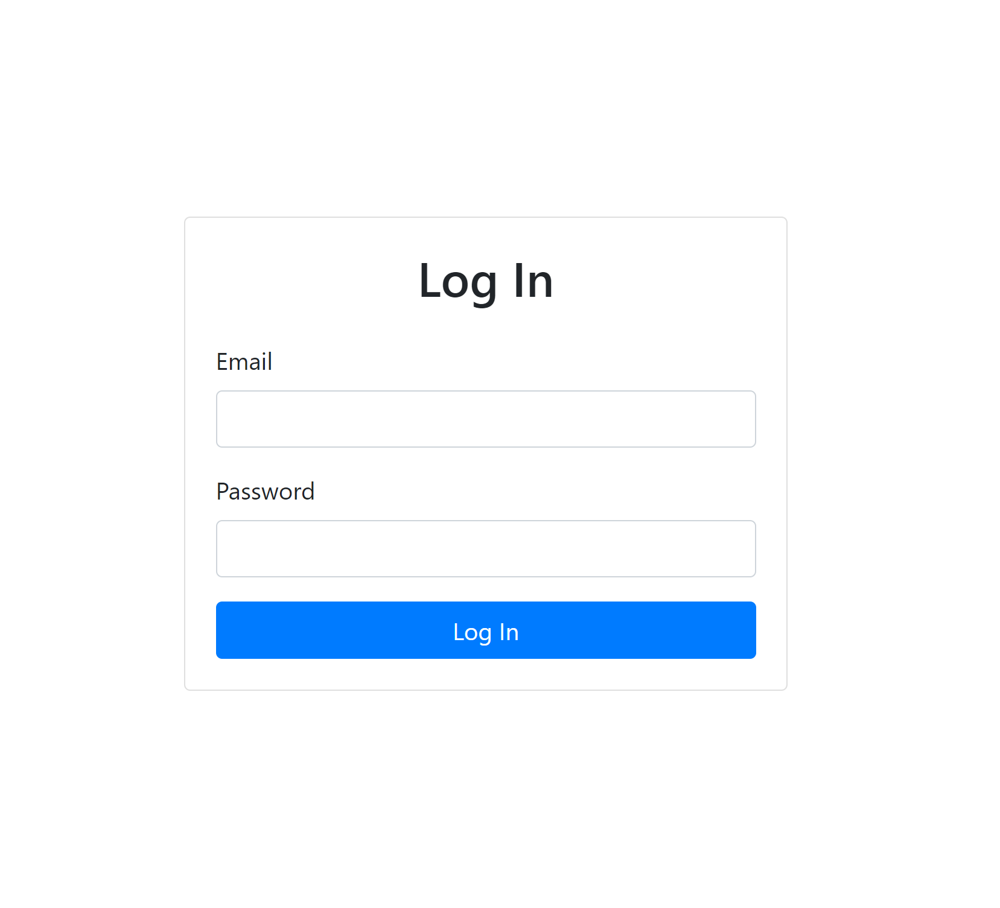
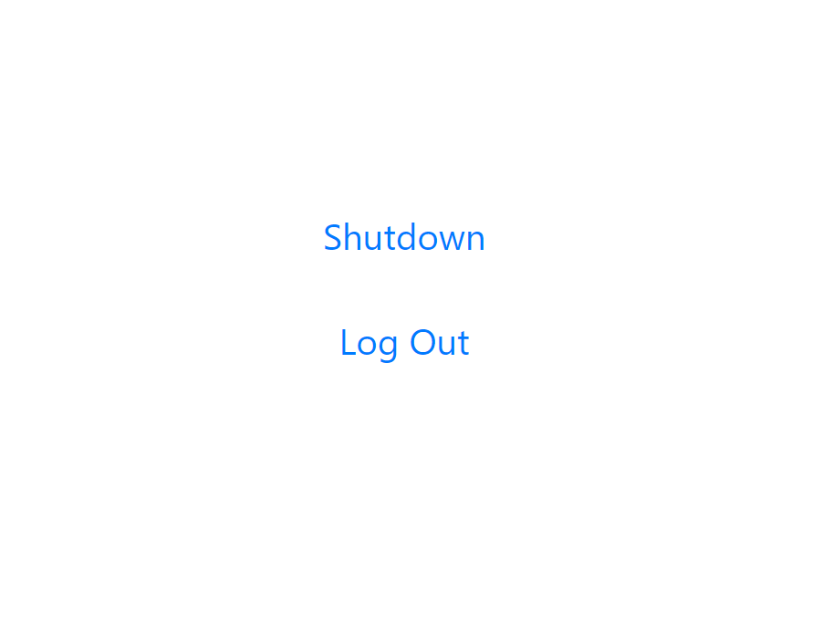

This project contains a web interface to shutdown my PC remotely. Once you login the website, there is a shutdown button that triggers firebase function. This firebase function changes a field called "state" in firestore database. A [python script](https://github.com/abdullahsumbal/pc-shutdown-listener) is listening to changes in the database and if the state is set to 0, it initiates the shutdown process.

I clone this project from https://github.com/WebDevSimplified/React-Firebase-Auth

## Getting Started

I am assuming you already have read instructions in [Python project](https://github.com/abdullahsumbal/pc-shutdown-listener).
In this project, there are instructions to setup a database and you need database to this project.

### 1. Get a Firebase Account

### 2. Create a New Project and Initialize the Authentication and Functions

> Create a new user in the authentication.
> Functions is not a free feature from Firebase. But it is very cheap and it cost 3 cents per months for this project size use.

### 3. Create a `.env` file in the root directory.

> You can find project config in the project settings. Add the following with config detials in the `.env` file

    REACT_APP_FIREBASE_API_KEY=
    REACT_APP_FIREBASE_AUTH_DOMAIN=
    REACT_APP_FIREBASE_DATABASE_URL=
    REACT_APP_FIREBASE_PROJECT_ID=
    REACT_APP_FIREBASE_STORAGE_BUCKET=
    REACT_APP_FIREBASE_MESSAGING_SENDER_ID=
    REACT_APP_FIREBASE_APP_ID=
    REACT_APP_MEASUREMENT_ID=

### Run `Firebase init`

Install Firebase CLI and Run `Firebase init` and follow the instructions on the console.

### Run `Firebase deploy`

This will deploy hosting and functions and will give you a link to test your application.
